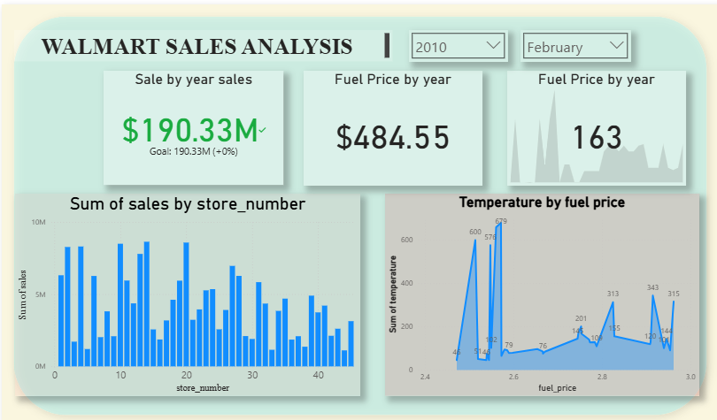

# 📊 Walmart Sales Analysis Project

This project presents a complete data analysis pipeline for Walmart sales data using the **medallion architecture (Bronze, Silver, Gold layers)** and **Power BI** for dashboarding.

## 🚀 Project Overview

- **Goal**: Analyze Walmart sales trends, fuel prices, CPI, and unemployment data.
- **Tech Stack**: SQL Server, Power BI
- **Architecture**: Medallion (Bronze, Silver, Gold)

---

## 🧱 Architecture

### 🔶 Bronze Layer
- Raw data import.
- No transformation applied.
- Stored procedures used for data loading.

### 🥈 Silver Layer
- Cleaned and standardized data.
- Typecasting, formatting (e.g., sales date), and rounding applied.

### 🥇 Gold Layer
- Final curated data for reporting.
- Exposed as a **view** using SQL.

---

## 📈 Dashboard Highlights

- ✅ Yearly Sales Summary
- ✅ Monthly Fuel Price Trend
- ✅ Sales Breakdown by Store
- ✅ Fuel Price by Store
- ✅ Interactive slicers (Year, Month)

